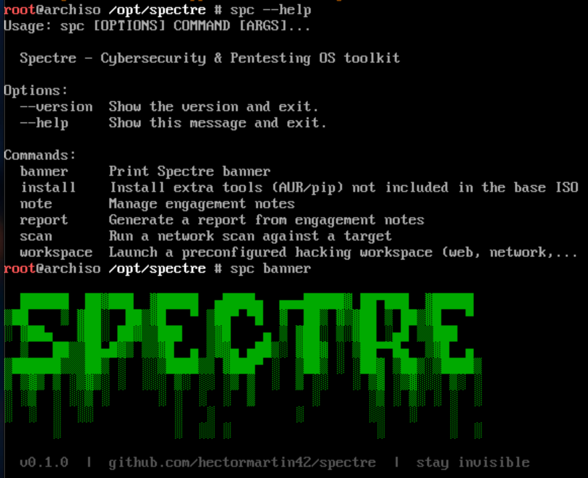

<div align="center">

```
  ██████  ██▓███  ▓█████  ▄████▄  ▄▄▄█████▓ ██▀███  ▓█████
▒██    ▒ ▓██░  ██▒▓█   ▀ ▒██▀ ▀█  ▓  ██▒ ▓▒▓██ ▒ ██▒▓█   ▀
░ ▓██▄   ▓██░ ██▓▒▒███   ▒▓█    ▄ ▒ ▓██░ ▒░▓██ ░▄█ ▒▒███
  ▒   ██▒▒██▄█▓▒ ▒▒▓█  ▄ ▒▓▓▄ ▄██▒░ ▓██▓ ░ ▒██▀▀█▄  ▒▓█  ▄
▒██████▒▒▒██▒ ░  ░░▒████▒▒ ▓███▀ ░  ▒██▒ ░ ░██▓ ▒██▒░▒████▒
```

### Cybersecurity & Pentesting OS — *stay invisible*

[](LICENSE)
[](https://github.com/hectormartin42/spectre/releases)
[](#iso)
[](https://github.com/hectormartin42/spectre/actions/workflows/iso.yml)
[](https://github.com/hectormartin42/spectre/releases)

**[Download ISO](https://github.com/hectormartin42/spectre/releases) · [Documentation](#the-spc-cli) · [Contribute](#contributing)**

</div>

---

## What is Spectre?

Spectre is a cybersecurity-focused operating system built for **real engagements**, not demos.

Most pentesting distros are just bloated tool dumps. Spectre is different:

- **Mission workspaces** — one command launches a fully configured environment per engagement type
- **`spc` CLI** — your unified command center: scanning, notes, reporting, tool management
- **Curated arsenal** — tools that matter, not 2800 packages nobody uses
- **Reproducible** — install on any Arch system in minutes, or boot the ISO

Built on **Arch Linux** with i3, Kitty, Fish and a dark neon theme that actually looks good.

---

## Screenshots

> *Spectre OS 0.1.0 booting and spc CLI in action*



---

## ISO

> **Download:** [github.com/hectormartin42/spectre/releases](https://github.com/hectormartin42/spectre/releases)

| File | Size | SHA256 |
|------|------|--------|
| `spectre-os-0.1.0-x86_64.iso` | ~2.9 GB | `8ff70586d8524bae0196699d92b9b58506b148dbd27c0c267fcee22d27b7c126` |

**Boot in QEMU:**
```bash
qemu-system-x86_64 -m 4G -cdrom spectre-os-0.1.0-x86_64.iso -boot d -enable-kvm
```

**Write to USB:**
```bash
sudo dd if=spectre-os-0.1.0-x86_64.iso of=/dev/sdX bs=4M status=progress && sync
```

**Boot options:**
- `Spectre OS` — standard live environment, auto-login as root
- `Forensics Mode` — no swap, no automount, safe for evidence collection

---

## Quick Install

Install `spc` on any existing Arch or Debian system:

```bash
curl -s https://raw.githubusercontent.com/hectormartin42/spectre/main/install.sh | bash
```

Or manually:

```bash
git clone https://github.com/hectormartin42/spectre
cd spectre && bash install.sh
```

---

## The `spc` CLI

```
spc <command> [options]

  banner     Print Spectre banner
  scan       Run a network scan against a target
  workspace  Launch a preconfigured hacking workspace
  note       Manage engagement notes
  report     Generate a report from engagement notes
  install    Install extra tools (AUR/pip)
```

### Scan

```bash
# Stealth scan — evade IDS/IPS
spc scan -t 10.10.10.1 --profile stealth

# Full aggressive with vuln scripts
spc scan -t 192.168.1.0/24 --profile aggressive --ports 1-65535

# Save output with custom name
spc scan -t example.com --profile quick -o recon_client_x
```

| Profile | Speed | Use case |
|---------|-------|----------|
| `stealth` | Slow | Evade detection |
| `normal` | Medium | Standard recon |
| `aggressive` | Fast | Full audit |
| `quick` | Fast | First look |

### Workspaces

```bash
spc workspace web        # Burp, ffuf, nuclei, sqlmap, gobuster
spc workspace network    # nmap, wireshark, responder, crackmapexec
spc workspace red-team   # metasploit, chisel, ligolo-ng, evil-winrm
spc workspace osint      # theHarvester, maltego, shodan, recon-ng
spc workspace forensics  # volatility3, ghidra, binwalk, autopsy
```

Each workspace opens a tmux layout with tools organized and your engagement notes visible.

### Notes & Reporting

```bash
# Take notes during an engagement
spc note add "Found SQLi on /login endpoint" --tag sqli --engagement client_x
spc note add "Admin creds: admin:Summer2024!" --tag cred -e client_x
spc note add "RCE via file upload" --tag rce -e client_x --file /tmp/proof.png

# Review notes
spc note list -e client_x

# Generate report
spc report -e client_x --format md
spc report -e client_x -f txt -o final_report_client_x
```

### Install Extra Tools

```bash
spc install ffuf          # Fast web fuzzer
spc install nuclei        # Template-based scanner
spc install theharvester  # Email & subdomain OSINT
spc install sherlock      # Username OSINT
spc install --list        # Show all available tools
spc install --all         # Install everything
```

---

## Tool Arsenal

<details>
<summary><b>Network</b></summary>

- `nmap` — port scanning & service detection
- `wireshark` — packet analysis
- `masscan` — high-speed port scanner
- `tcpdump` — packet capture
- `arp-scan` — network discovery

</details>

<details>
<summary><b>Web</b></summary>

- `sqlmap` — SQL injection automation
- `gobuster` — directory/DNS brute-force
- `nikto` — web server scanner
- `ffuf` — fast fuzzer *(via `spc install ffuf`)*
- `nuclei` — template-based scanner *(via `spc install nuclei`)*

</details>

<details>
<summary><b>Password</b></summary>

- `john` — John the Ripper
- `hashcat` — GPU-accelerated cracking
- `hydra` — online brute-force

</details>

<details>
<summary><b>Exploitation</b></summary>

- `metasploit` — exploitation framework
- `exploitdb` — local exploit database

</details>

<details>
<summary><b>OSINT</b></summary>

- `theHarvester` — email & subdomain harvesting *(via `spc install`)*
- `recon-ng` — web recon framework *(via `spc install`)*
- `sherlock` — username OSINT *(via `spc install`)*

</details>

<details>
<summary><b>Forensics & RE</b></summary>

- `volatility3` — memory forensics
- `ghidra` — reverse engineering
- `radare2` — RE framework
- `binwalk` — firmware analysis
- `sleuthkit` — disk forensics

</details>

<details>
<summary><b>Wireless</b></summary>

- `aircrack-ng` — WiFi auditing
- `bettercap` — network attacks
- `kismet` — wireless monitoring

</details>

---

## Environment

| Component | Choice |
|-----------|--------|
| Base | Arch Linux (rolling) |
| WM | i3-gaps |
| Terminal | Kitty |
| Shell | Fish |
| Fonts | JetBrainsMono Nerd Font |
| Theme | Dark + neon green `#00ff9f` |

---

## Build from Source

```bash
# Requires Arch Linux + archiso
sudo pacman -S archiso
sudo bash iso/build.sh
```

See [iso/README.md](iso/README.md) for full documentation.

---

## Roadmap

- [x] `spc` CLI — scan, workspace, note, report, install
- [x] 5 mission workspaces (web, network, red-team, osint, forensics)
- [x] Bootable ISO with archiso
- [x] Forensics boot mode
- [x] i3 + Kitty + Fish environment
- [x] Bootstrap installer (Arch/Debian)
- [ ] Hyprland config + animations
- [ ] `spc target` — engagement target management
- [ ] `spc payload` — payload generation shortcuts
- [ ] `spc vpn` — HTB/THM VPN one-click connect
- [ ] Web dashboard for engagement reports
- [ ] Installer (archinstall-based, guided)
- [ ] ARM64 ISO (Raspberry Pi / Apple Silicon)

---

## Contributing

Pull requests are welcome. Open an issue first for major changes.

```bash
git clone https://github.com/hectormartin42/spectre
cd spectre
git checkout -b feature/my-feature
# make your changes
git push origin feature/my-feature
# open a PR
```

---

## Legal

Spectre is intended for **authorized security testing**, CTF competitions, and educational use only.
The authors are not responsible for misuse. Always get written permission before testing.

---

<div align="center">
<sub>Built with ☠️ by <a href="https://github.com/hectormartin42">hectormartin42</a> — stay invisible</sub>
</div>
